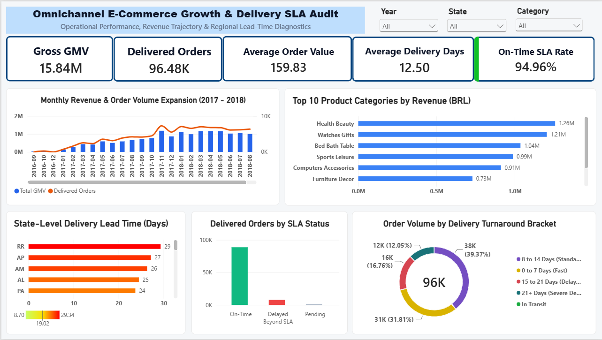
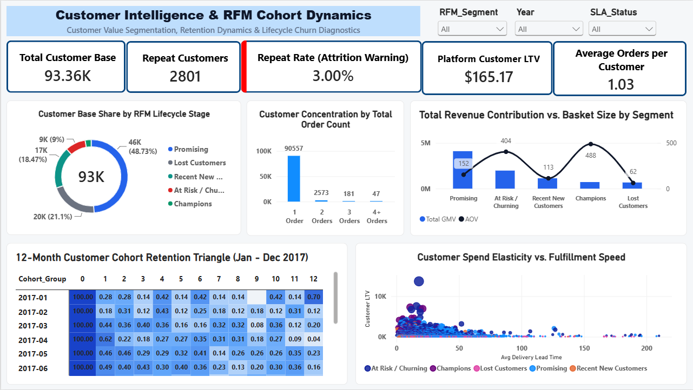

# 🛒 E-Commerce Omnichannel Intelligence & Cohort Retention Analytics
### Enterprise SQL KPI Engine, RFM Segmentation, 12-Month Cohort Retention & Financial Freight Audit

### 📥 Dataset Source & Data Access
The raw data is sourced from the official **Brazilian E-Commerce Public Dataset by Olist** on Kaggle:
* **Source:** [Kaggle — Brazilian E-Commerce Public Dataset by Olist](https://www.kaggle.com/datasets/olistbr/brazilian-ecommerce)
* **Scope:** 100,000 anonymized real commercial orders placed across Brazil between 2016 and 2018.


---

## 📌 Executive Summary & Project Purpose

This project provides an end-to-end commercial analytics pipeline across **99,441 transactional records** (~100k orders) from Brazilian e-commerce operations between 2016 and 2018. 

The primary business problem addressed is **marketplace retention fragility and logistics margin leakage**:
* While platform gross merchandise value expanded aggressively to **R$ 15.84M**, natural repeat customer acquisition collapsed to **3.00%**.
* Over **97% of unique buyers** never returned for a second order, revealing that top-of-funnel marketing investments were heavily depreciated by immediate churn.
* Geographic delivery bottlenecks in Northern territories created **25–30+ day fulfillment delays**, subsidizing carrier costs by up to **8% per delivery** and triggering negative customer reviews.

To diagnose and resolve these operational leaks, an enterprise data pipeline was engineered using **Python (Pandas & Parquet)**, **PostgreSQL (Star Schema, Window Functions & RFM)**, an **Excel Financial Reconciliation Model (Power Query & Dynamic Formulas)**, and an **Executive Power BI Dashboard (DAX & Lifecycle Analytics)**.

---

## 📈 Dashboard Architecture (Power BI)

### Page 1: Omnichannel Growth & Logistics Performance
> **Focus:** High-level platform GMV expansion, order volume trajectory, unit economics (AOV), and geographical delivery turnaround bottlenecks across Brazilian states.



---

### Page 2: Customer Retention & RFM Cohort Dynamics
> **Focus:** Customer lifecycle health, NTILE-derived RFM behavioral segments, basket-size asymmetry, and 12-month cohort retention decay analysis.



---

## 📊 Key Business Observations & Insights

### 1. The Single-Transaction Acquisition Trap
* While top-of-funnel customer acquisition scaled rapidly across the country, the platform suffered from near-total customer drop-off after the first purchase.

* The business functioned essentially as a one-time buyer machine rather than a compounding recurring-revenue model, indicating that high customer acquisition costs (CAC) were not being offset by lifetime value (LTV).

---

### 2. Immediate Post-Unboxing Drop-Off (Month 1 Cliff)

* The 12-month cohort retention analysis revealed that the vast majority of customer churn occurred immediately within the first 30 days after the initial transaction.

* Once a customer surpassed Month 1 without placing a second order, retention leveled off into a flat, negligible baseline. This proved that customer churn is driven by a lack of immediate post-delivery engagement rather than long-term platform dissatisfaction.
---

### 3. High-Value Concentration in Champions

* Customer segmentation revealed extreme value asymmetry: a small tier of top-decile buyers ("Champions") generated average basket sizes nearly double that of typical buyers.

* Conversely, a substantial portion of historical GMV remained locked in stagnant "At-Risk" and "Lost" accounts that had not engaged with the marketplace in over six to twelve months.

---

### 4. Geographic Logistics Polarization

* Order fulfillment times showed stark regional disparities. Core metropolitan hubs in the Southeast (like São Paulo) benefited from fast delivery turnaround times, operating smoothly within promised carrier allowances.

* In contrast, remote and Northern territories suffered from severe fulfillment bottlenecks with transit times extending multiple weeks, degrading customer satisfaction and directly suppressing repeat purchases in those regions.

---

## 📌 Strategic Conclusions & Executive Recommendations
### 1. Trigger Automated Re-Engagement within the Unboxing Window:

* Because attrition happens almost entirely in Month 1, marketing automation should trigger tailored replenishment reminders, cross-category recommendations, and time-sensitive incentives within 14 to 21 days post-delivery—while unboxing satisfaction is fresh.

### 2. Protect High-Value Buyers with Dedicated Loyalty Perks:

* With Champions delivering disproportionately high basket values, the business should introduce dedicated loyalty tiers, exclusive product drops, and priority customer care to prevent these vital revenue contributors from drifting into the at-risk segment.

### 3. Transition from Blanket Free Shipping to Dynamic Surcharges:

* To plug freight margin leakage, the platform should implement dynamic, distance-based shipping rate cards at checkout, ensuring carrier base costs in long-haul delivery zones are fully recovered or subsidized only on high-margin baskets.

---

## 🏗️ Analytics Architecture & Data Pipeline
```
[ Raw CSV Datasets (~100k Orders) ]
│
▼
[ 01_Python Processing Pipeline ]
├── Null & Anomaly Imputation
├── ISO Date/Time Normalization
├── Delivered-Grain Filtering (order_status = 'delivered')
└── Snappy-Compressed Parquet Storage (70% size reduction)
│
▼
[ 02_PostgreSQL Star Schema ]
├── DDL: Dim/Fact Modeling with Primary/Foreign Keys
├── Script 02: KPI Engine (AOV, Repeat Purchase Rate, SLAs)
└── Script 03: RFM Customer Segmentation (NTILE Quintiles)
│
┌───────┴────────────────────────┐
▼                                ▼
[ 03_Excel Financial Model ]    [ 04_Power BI Executive Suite ]
├── Power Query Multi-Join      ├── Star Schema Data Model
├── Dynamic Array Formulas      ├── 15+ Advanced DAX Measures
├── Freight Variance Audit      ├── Page 1: Growth & Logistics SLA
└── Rate-Card Leakage Detection └── Page 2: RFM & Cohort Dynamics

```
---

## 🛠️ Tech Stack & Capabilities

| Technology | Role in Architecture | Key Libraries / Functions Used |
| :--- | :--- | :--- |
| **Python** | Data Cleaning, Pipeline Automation & EDA | `pandas`, `numpy`, `matplotlib`, `seaborn`, `pyarrow` (Parquet) |
| **PostgreSQL** | Relational Star Schema & Analytics Engine | `NTILE(5)`, `CASE WHEN`, `EXTRACT(EPOCH)`, Window Functions, CTEs |
| **Microsoft Excel** | Financial Reconciliation & Freight Audits | Power Query, `LET()`, `XLOOKUP()`, `SORT(UNIQUE())`, Dynamic Spills |
| **Power BI** | Executive BI Dashboarding & Modeling | Star Schema, `CALCULATE()`, `AVERAGEX()`, `CROSSFILTER()`, Matrix Heatmaps |
| **Git / GitHub** | Version Control & Portfolio Presentation | Production directory architecture, Git hygiene, `.gitignore` |

---
